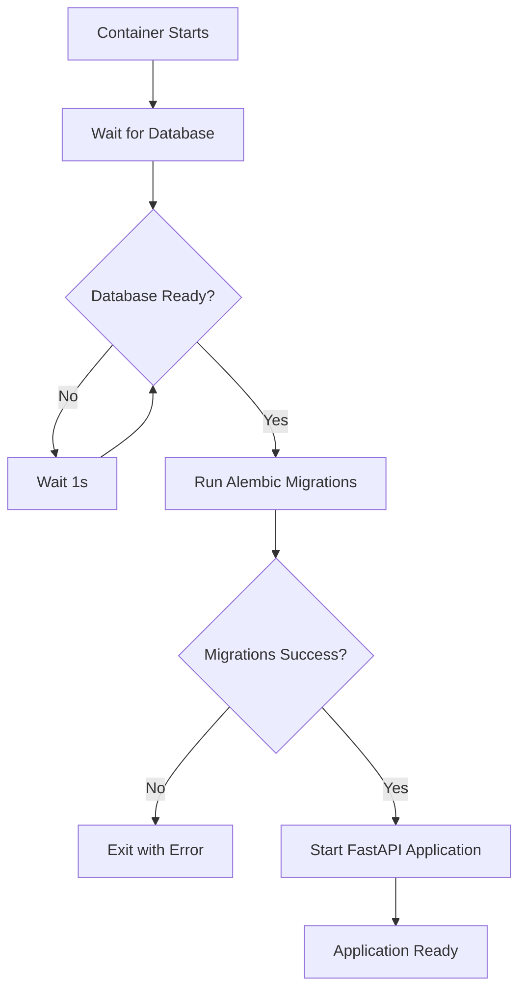

# 🚀 Production Deployment with Automatic Migrations

This guide explains how to deploy Spendly with automatic database migrations.

## 🔄 What's New

- ✅ **Automatic Migrations**: Database migrations run automatically on container startup
- ✅ **Zero-Downtime**: No manual intervention needed for database updates
- ✅ **Production Safe**: Includes proper error handling and rollback capabilities
- ✅ **Health Checks**: Extended startup time to accommodate migrations

## 📋 Prerequisites

1. **Environment Variables**: Ensure all required environment variables are set
2. **Database Access**: Production database must be accessible from the backend container
3. **Backup**: Always backup your database before deploying major updates

## 🚀 Deployment Process

### Step 1: Update Your Environment File

Make sure your production environment variables include:

```bash
# Database Configuration
DB_HOST=database
DB_PORT=5432
DB_NAME=spendly_prod
DB_USER=spendly_user
DB_PASSWORD=your_secure_password

# Application Configuration
ENVIRONMENT=production
JWT_SECRET=your_jwt_secret
```

### Step 2: Deploy via Portainer

1. **Access Portainer**: Go to your Portainer interface
2. **Navigate to Stacks**: Find your Spendly stack
3. **Update Stack**: 
   - Pull latest code or update the stack configuration
   - Click "Update the stack"
4. **Monitor Deployment**: 
   - Watch the logs for migration progress
   - Backend will show: "🔄 Running database migrations..."
   - Wait for: "✅ Database migrations completed successfully"

### Step 3: Verify Deployment

Check the backend logs to ensure everything started correctly:

```bash
# View backend logs
docker logs spendly-backend

# Look for these success messages:
# ✅ Database is ready!
# ✅ Database migrations completed successfully  
# 🚀 Starting FastAPI application...
```

## 📊 Migration Flow

The new startup process follows this sequence:



## 🛠️ Key Files Modified

### Backend Changes:
- ✅ `scripts/start-production.sh` - New startup script with migrations
- ✅ `Dockerfile.prod` - Updated to use startup script
- ✅ `requirements-prod.txt` - Added Alembic dependency

### Infrastructure Changes:
- ✅ `portainer-stack.yml` - Extended health check timing
- ✅ Restart policies for better reliability

## 🐛 Troubleshooting

### Migration Fails
```bash
# Check backend logs
docker logs spendly-backend

# Common issues:
# - Database connection timeout
# - Missing environment variables
# - Conflicting data in database
```

### Application Won't Start
```bash
# Check if migrations completed
docker exec spendly-backend python -m alembic current

# Check application health
curl http://your-server:8001/health
```

### Rollback Migration (if needed)
```bash
# Rollback last migration
docker exec spendly-backend python -m alembic downgrade -1

# Check current migration
docker exec spendly-backend python -m alembic current
```

## 🔧 Manual Migration (Emergency)

If automatic migrations fail, you can run them manually:

```bash
# SSH to your server
ssh your-server

# Run migration manually
docker exec spendly-backend python -m alembic upgrade head

# Restart backend container
docker restart spendly-backend
```

## 📈 Benefits

- ✅ **Consistent Deployments**: Same process every time
- ✅ **Reduced Errors**: No manual migration steps to forget
- ✅ **Better Logging**: Clear visibility into migration status
- ✅ **Production Safety**: Built-in error handling and timeouts

## 🚨 Important Notes

1. **Backup First**: Always backup your database before major deployments
2. **Monitor Closely**: Watch the first few deployments to ensure everything works
3. **Test Locally**: Test migrations in development/staging first
4. **Keep Backups**: Have a rollback plan ready

## 🔄 Next Deployment

For your next deployment with migrations:

1. **Commit your changes** to git
2. **Update Portainer stack** (pull latest code)
3. **Deploy** - migrations will run automatically
4. **Verify** - check logs and application health

---

## 📞 Support

If you encounter issues:
1. Check the backend container logs
2. Verify database connectivity
3. Ensure all environment variables are set correctly
4. Test migration manually if needed

**Happy deploying!** 🎉
