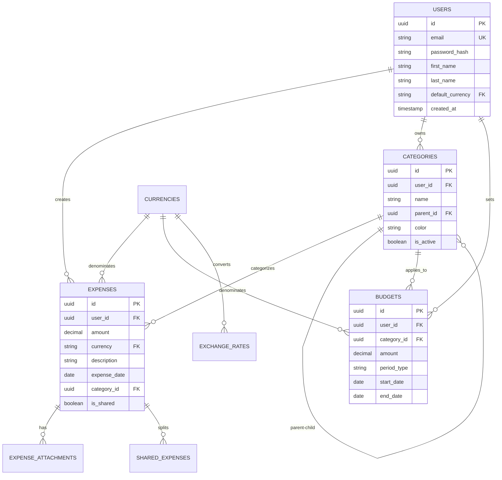

# Database Design

This document outlines the database schema and design decisions for the Spendly expense tracking platform.

## 📋 Table of Contents

1. [Database Overview](#database-overview)
2. [Schema Design](#schema-design)
3. [Entity Relationships](#entity-relationships)
4. [Data Migration](#data-migration)
5. [Performance Considerations](#performance-considerations)
6. [Backup Strategy](#backup-strategy)

## 🗄️ Database Overview

### Technology Choice
- **Primary**: PostgreSQL 15+
- **Development**: PostgreSQL (Docker)
- **Production**: PostgreSQL (self-hosted)
- **Caching**: Redis for session and query caching

### Design Principles
- **Normalization**: 3NF with selective denormalization for performance
- **ACID Compliance**: Full transaction support
- **Scalability**: Designed for future horizontal scaling
- **Data Integrity**: Foreign keys and constraints
- **Audit Trail**: Created/updated timestamps on all entities

## 🏗️ Schema Design

### Core Tables

#### Users Table
```sql
CREATE TABLE users (
    id UUID PRIMARY KEY DEFAULT gen_random_uuid(),
    email VARCHAR(255) UNIQUE NOT NULL,
    password_hash VARCHAR(255) NOT NULL,
    first_name VARCHAR(100) NOT NULL,
    last_name VARCHAR(100) NOT NULL,
    default_currency VARCHAR(3) NOT NULL DEFAULT 'EUR',
    timezone VARCHAR(50) DEFAULT 'Europe/Zurich',
    date_format VARCHAR(20) DEFAULT 'DD/MM/YYYY',
    language VARCHAR(5) DEFAULT 'en',
    is_active BOOLEAN DEFAULT true,
    email_verified BOOLEAN DEFAULT false,
    last_login_at TIMESTAMP,
    created_at TIMESTAMP DEFAULT CURRENT_TIMESTAMP,
    updated_at TIMESTAMP DEFAULT CURRENT_TIMESTAMP
);

-- Indexes
CREATE INDEX idx_users_email ON users(email);
CREATE INDEX idx_users_active ON users(is_active);
```

#### Categories Table (Primary & Secondary)
```sql
CREATE TABLE categories (
    id UUID PRIMARY KEY DEFAULT gen_random_uuid(),
    user_id UUID REFERENCES users(id) ON DELETE CASCADE,
    name VARCHAR(100) NOT NULL,
    parent_id UUID REFERENCES categories(id) ON DELETE SET NULL,
    color VARCHAR(7), -- Hex color code
    icon VARCHAR(50), -- Icon identifier
    is_active BOOLEAN DEFAULT true,
    sort_order INTEGER DEFAULT 0,
    created_at TIMESTAMP DEFAULT CURRENT_TIMESTAMP,
    updated_at TIMESTAMP DEFAULT CURRENT_TIMESTAMP,
    
    UNIQUE(user_id, name, parent_id)
);

-- Indexes
CREATE INDEX idx_categories_user ON categories(user_id);
CREATE INDEX idx_categories_parent ON categories(parent_id);
CREATE INDEX idx_categories_active ON categories(is_active);
```

#### Currencies Table
```sql
CREATE TABLE currencies (
    code VARCHAR(3) PRIMARY KEY, -- ISO 4217 codes
    name VARCHAR(100) NOT NULL,
    symbol VARCHAR(10) NOT NULL,
    decimal_places INTEGER DEFAULT 2,
    is_active BOOLEAN DEFAULT true,
    created_at TIMESTAMP DEFAULT CURRENT_TIMESTAMP,
    updated_at TIMESTAMP DEFAULT CURRENT_TIMESTAMP
);

-- Initial data
INSERT INTO currencies (code, name, symbol) VALUES
('EUR', 'Euro', '€'),
('USD', 'US Dollar', '$'),
('CHF', 'Swiss Franc', 'CHF'),
('MAD', 'Moroccan Dirham', 'MAD');
```

#### Exchange Rates Table
```sql
CREATE TABLE exchange_rates (
    id UUID PRIMARY KEY DEFAULT gen_random_uuid(),
    from_currency VARCHAR(3) REFERENCES currencies(code),
    to_currency VARCHAR(3) REFERENCES currencies(code),
    rate DECIMAL(10, 6) NOT NULL,
    rate_date DATE NOT NULL,
    source VARCHAR(50) DEFAULT 'manual', -- 'api', 'manual'
    created_at TIMESTAMP DEFAULT CURRENT_TIMESTAMP,
    
    UNIQUE(from_currency, to_currency, rate_date)
);

-- Indexes
CREATE INDEX idx_exchange_rates_currencies ON exchange_rates(from_currency, to_currency);
CREATE INDEX idx_exchange_rates_date ON exchange_rates(rate_date);
```

#### Expenses Table
```sql
CREATE TABLE expenses (
    id UUID PRIMARY KEY DEFAULT gen_random_uuid(),
    user_id UUID REFERENCES users(id) ON DELETE CASCADE,
    amount DECIMAL(12, 2) NOT NULL,
    currency VARCHAR(3) REFERENCES currencies(code),
    amount_in_base_currency DECIMAL(12, 2), -- Converted to user's default currency
    exchange_rate DECIMAL(10, 6), -- Rate used for conversion
    description VARCHAR(500) NOT NULL,
    expense_date DATE NOT NULL,
    category_id UUID REFERENCES categories(id),
    subcategory_id UUID REFERENCES categories(id),
    payment_method VARCHAR(50), -- 'cash', 'card', 'bank_transfer', 'other'
    receipt_url VARCHAR(500), -- File path or URL
    notes TEXT,
    is_shared BOOLEAN DEFAULT false,
    shared_with JSON, -- Array of user IDs for shared expenses
    tags JSON, -- Array of tags
    location VARCHAR(200),
    vendor VARCHAR(200),
    created_at TIMESTAMP DEFAULT CURRENT_TIMESTAMP,
    updated_at TIMESTAMP DEFAULT CURRENT_TIMESTAMP,
    
    CONSTRAINT positive_amount CHECK (amount > 0)
);

-- Indexes
CREATE INDEX idx_expenses_user ON expenses(user_id);
CREATE INDEX idx_expenses_date ON expenses(expense_date);
CREATE INDEX idx_expenses_category ON expenses(category_id);
CREATE INDEX idx_expenses_currency ON expenses(currency);
CREATE INDEX idx_expenses_shared ON expenses(is_shared);
CREATE INDEX idx_expenses_user_date ON expenses(user_id, expense_date);
```

#### Budgets Table
```sql
CREATE TABLE budgets (
    id UUID PRIMARY KEY DEFAULT gen_random_uuid(),
    user_id UUID REFERENCES users(id) ON DELETE CASCADE,
    category_id UUID REFERENCES categories(id),
    name VARCHAR(200) NOT NULL,
    amount DECIMAL(12, 2) NOT NULL,
    currency VARCHAR(3) REFERENCES currencies(code),
    period_type VARCHAR(20) NOT NULL, -- 'monthly', 'yearly', 'weekly'
    start_date DATE NOT NULL,
    end_date DATE,
    is_active BOOLEAN DEFAULT true,
    alert_threshold DECIMAL(5, 2) DEFAULT 80.0, -- Alert at 80% of budget
    created_at TIMESTAMP DEFAULT CURRENT_TIMESTAMP,
    updated_at TIMESTAMP DEFAULT CURRENT_TIMESTAMP,
    
    CONSTRAINT valid_period CHECK (end_date IS NULL OR end_date > start_date),
    CONSTRAINT positive_amount CHECK (amount > 0),
    CONSTRAINT valid_threshold CHECK (alert_threshold > 0 AND alert_threshold <= 100)
);

-- Indexes
CREATE INDEX idx_budgets_user ON budgets(user_id);
CREATE INDEX idx_budgets_category ON budgets(category_id);
CREATE INDEX idx_budgets_active ON budgets(is_active);
CREATE INDEX idx_budgets_period ON budgets(start_date, end_date);
```

### Support Tables

#### Expense Attachments Table
```sql
CREATE TABLE expense_attachments (
    id UUID PRIMARY KEY DEFAULT gen_random_uuid(),
    expense_id UUID REFERENCES expenses(id) ON DELETE CASCADE,
    filename VARCHAR(255) NOT NULL,
    original_filename VARCHAR(255) NOT NULL,
    file_path VARCHAR(500) NOT NULL,
    file_size BIGINT NOT NULL,
    mime_type VARCHAR(100) NOT NULL,
    created_at TIMESTAMP DEFAULT CURRENT_TIMESTAMP
);

-- Indexes
CREATE INDEX idx_attachments_expense ON expense_attachments(expense_id);
```

#### Shared Expenses Table
```sql
CREATE TABLE shared_expenses (
    id UUID PRIMARY KEY DEFAULT gen_random_uuid(),
    expense_id UUID REFERENCES expenses(id) ON DELETE CASCADE,
    shared_with_user_id UUID REFERENCES users(id) ON DELETE CASCADE,
    amount_owed DECIMAL(12, 2) NOT NULL,
    currency VARCHAR(3) REFERENCES currencies(code),
    is_settled BOOLEAN DEFAULT false,
    settled_at TIMESTAMP,
    notes TEXT,
    created_at TIMESTAMP DEFAULT CURRENT_TIMESTAMP,
    updated_at TIMESTAMP DEFAULT CURRENT_TIMESTAMP,
    
    UNIQUE(expense_id, shared_with_user_id)
);

-- Indexes
CREATE INDEX idx_shared_expenses_expense ON shared_expenses(expense_id);
CREATE INDEX idx_shared_expenses_user ON shared_expenses(shared_with_user_id);
CREATE INDEX idx_shared_expenses_settled ON shared_expenses(is_settled);
```

#### Audit Log Table
```sql
CREATE TABLE audit_logs (
    id UUID PRIMARY KEY DEFAULT gen_random_uuid(),
    user_id UUID REFERENCES users(id),
    table_name VARCHAR(100) NOT NULL,
    record_id UUID NOT NULL,
    action VARCHAR(20) NOT NULL, -- 'INSERT', 'UPDATE', 'DELETE'
    old_values JSON,
    new_values JSON,
    ip_address INET,
    user_agent TEXT,
    created_at TIMESTAMP DEFAULT CURRENT_TIMESTAMP
);

-- Indexes
CREATE INDEX idx_audit_logs_user ON audit_logs(user_id);
CREATE INDEX idx_audit_logs_table ON audit_logs(table_name);
CREATE INDEX idx_audit_logs_record ON audit_logs(record_id);
CREATE INDEX idx_audit_logs_created ON audit_logs(created_at);
```

## 🔗 Entity Relationships

### Relationship Diagram



### Key Relationships

1. **User → Expenses**: One-to-many (user owns multiple expenses)
2. **User → Categories**: One-to-many (user defines categories)
3. **User → Budgets**: One-to-many (user sets budgets)
4. **Category → Expenses**: One-to-many (category has multiple expenses)
5. **Category → Category**: Self-referencing (parent-child hierarchy)
6. **Expense → Attachments**: One-to-many (expense can have multiple receipts)
7. **Expense → Shared Expenses**: One-to-many (expense can be split with multiple users)

## 📊 Data Migration from Excel

### Migration Strategy

#### Phase 1: Structure Mapping
```sql
-- Excel "Expenses Short" sheet → expenses table with aggregation
-- Excel "Expenses" sheet → expenses table with full detail
-- Excel monthly sheets → expenses table with date filtering
-- Excel categories → categories table with hierarchy
```

#### Phase 2: Data Import Script
```python
from typing import List, Dict, Any
from dataclasses import dataclass
from datetime import date
from decimal import Decimal

@dataclass
class ExcelExpenseRow:
    primary: str
    secondary: str
    amount: Decimal
    currency: str
    date: date
    description: str

class ExcelMigration:
    def import_expenses(self, excel_data: List[ExcelExpenseRow]) -> None:
        for row in excel_data:
            # 1. Find or create category
            category = self.find_or_create_category(row.primary, row.secondary)
            
            # 2. Convert currency if needed
            converted_amount = self.convert_currency(row.amount, row.currency)
            
            # 3. Create expense record
            self.create_expense({
                "amount": row.amount,
                "currency": row.currency,
                "amount_in_base_currency": converted_amount,
                "description": row.description,
                "expense_date": row.date,
                "category_id": category.id
            })
```

#### Phase 3: Validation
```sql
-- Validate total amounts match
SELECT 
  SUM(amount_in_base_currency) as total_imported,
  (SELECT SUM(amount) FROM excel_backup) as total_excel
FROM expenses 
WHERE expense_date BETWEEN '2024-01-01' AND '2024-12-31';

-- Validate category distribution
SELECT 
  c.name,
  COUNT(*) as expense_count,
  SUM(e.amount_in_base_currency) as total_amount
FROM expenses e
JOIN categories c ON e.category_id = c.id
GROUP BY c.name
ORDER BY total_amount DESC;
```

## ⚡ Performance Considerations

### Indexing Strategy

```sql
-- Composite indexes for common queries
CREATE INDEX idx_expenses_user_date_category ON expenses(user_id, expense_date, category_id);
CREATE INDEX idx_expenses_date_amount ON expenses(expense_date, amount_in_base_currency);

-- Partial indexes for filtered queries
CREATE INDEX idx_expenses_shared_only ON expenses(user_id, expense_date) WHERE is_shared = true;
CREATE INDEX idx_active_budgets ON budgets(user_id, category_id) WHERE is_active = true;
```

### Query Optimization

```sql
-- Monthly expense summary (optimized)
CREATE MATERIALIZED VIEW monthly_expense_summary AS
SELECT 
  user_id,
  DATE_TRUNC('month', expense_date) as month,
  category_id,
  currency,
  SUM(amount) as total_amount,
  SUM(amount_in_base_currency) as total_base_amount,
  COUNT(*) as expense_count
FROM expenses
GROUP BY user_id, DATE_TRUNC('month', expense_date), category_id, currency;

-- Refresh schedule
CREATE INDEX ON monthly_expense_summary(user_id, month);
```

### Partitioning Strategy

```sql
-- Partition expenses by date for large datasets
CREATE TABLE expenses_partitioned (
  LIKE expenses INCLUDING ALL
) PARTITION BY RANGE (expense_date);

-- Create monthly partitions
CREATE TABLE expenses_2024_01 PARTITION OF expenses_partitioned
    FOR VALUES FROM ('2024-01-01') TO ('2024-02-01');
-- ... continue for each month
```

## 💾 Backup Strategy

### Automated Backups

```bash
#!/bin/bash
# backup-database.sh

DB_NAME="spendly"
BACKUP_DIR="/backups"
DATE=$(date +%Y%m%d_%H%M%S)

# Full backup
pg_dump -h localhost -U postgres $DB_NAME > $BACKUP_DIR/full_backup_$DATE.sql

# Schema only backup
pg_dump -h localhost -U postgres --schema-only $DB_NAME > $BACKUP_DIR/schema_$DATE.sql

# Data only backup
pg_dump -h localhost -U postgres --data-only $DB_NAME > $BACKUP_DIR/data_$DATE.sql

# Compress backups
gzip $BACKUP_DIR/full_backup_$DATE.sql
gzip $BACKUP_DIR/data_$DATE.sql

# Keep only last 30 days
find $BACKUP_DIR -name "*.gz" -mtime +30 -delete
```

### Point-in-Time Recovery

```sql
-- Enable WAL archiving
ALTER SYSTEM SET wal_level = replica;
ALTER SYSTEM SET archive_mode = on;
ALTER SYSTEM SET archive_command = 'cp %p /backup/wal/%f';

-- Create base backup
SELECT pg_start_backup('base_backup');
-- Copy data directory
SELECT pg_stop_backup();
```

### Disaster Recovery

```sql
-- Restore from backup
-- 1. Stop application
-- 2. Restore database
psql -h localhost -U postgres -d postgres -c "DROP DATABASE IF EXISTS spendly;"
psql -h localhost -U postgres -d postgres -c "CREATE DATABASE spendly;"
psql -h localhost -U postgres -d spendly -f /backups/full_backup_latest.sql

-- 3. Verify data integrity
SELECT COUNT(*) FROM expenses;
SELECT COUNT(*) FROM users;
-- 4. Restart application
```

---

**Implementation Timeline**:
1. **Week 1**: Core tables (users, categories, expenses)
2. **Week 2**: Budget and shared expense tables
3. **Week 3**: Support tables and indexes
4. **Week 4**: Migration scripts and testing